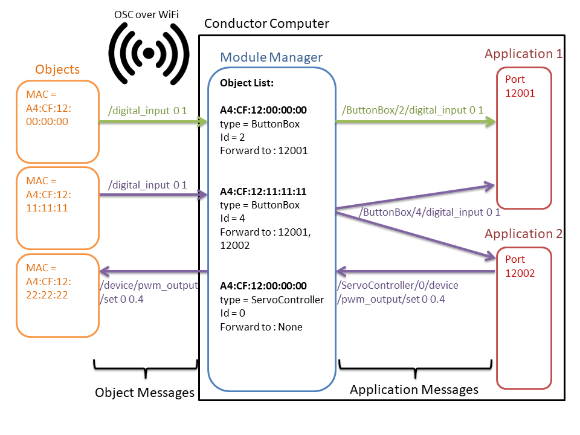

# OSC messages format – ConnectedScenicObject 

Messages OSC (over WIFI – Between Conductor Computer and Objects)

By default, all connected objects are listening to the port **9000**. On the other side, the Module Manager on the Conductor is listening to the port **9001**.

The Module Manager acts as an interface between the objects and the applications. 
It maintains a list of connected devices (identified by their MAC address), 
each related  to a type of object, a unique id for this type 
and a list of ports (corresponding to the applications) to forward messages on.
To let the applications knows from which module the message is comming from, it will add a header to this message.
This header is made by concatenating the type and the id of the object which sent the message to the message itself.
Similarly, the applications will have to tell the Module Manager to which module their message is intended by 
adding the same kind of header. The Module Manager will then remove this header before forwarding to the objects.
The following diagram illustrates this.


You can use the objects without the Module Manager by creating your own application listening on port 9001 and
re-implement the Generic messages handling (see below).

If you choose to use the Module Manager, then your applications will have to listen on another port than 9001
and will have to handle the messages with header.

## Object messages

### Generic messages
These are the messages that every object will understand or be able to send.

#### Knocking on network door

`/knockknock`

Message from an object broadcasted to the network.  

On boot, each object broadcasts (at this point, the Object does not know Master’s IP address) `/knocknock` to 
notify the Module Manager it is alive and connected to the WiFi network. 

#### Who's there

`/who`

Broadcast or one-to-one message from Module Manager to all Objects. 

The Module MANAGER sends this message automatically after receiving a `/knockknock`. 
The objects will answer with `/iam`. 

#### Present self (Objects)

`/iam s [[s i] [s i]...](MAC Address, [[device, number] [device, number]...])`

Message from an Object to the Module Manager. Sent in response to `/who`

The object sends it after receiving a `/who` and put its own Mac Address in the answer. 
It gives also a list of the devices it has and the number of each one. 

**Examples :**
```
/iam “A4:CF:12:11:11:11” “digital_input” 3 
/iam “A4:CF:12:00:00:00” “pwm_output” 1 “digital_input” 1 
/iam “A4:CF:12:22:22:22” “ledstrip” 222 “digital_input” 2 
```
 
#### Blink the status LED
`/status_led/blink`

Message from Module Manager to an Object. 

The object will make the led status blink red for 5 seconds. 

Optionally, `/status_led/blink` can be send with two int parameters, first is the number of seconds to blink, 
second represents the color as returned by “color()” function in Processing. 

If number of seconds is equal to or less than 0, the status led will blink forever. 
To stop the blinking, send a `/status_led/blink/stop` or a `/status_led/set_color` message 

 
#### Change the status LED color
`/status_led/set_color i (Color) `

Message from the Module Manager to an Object. 

The objects set its led status to the given color as returned by “color()” function in Processing. 
This message will stop status led blinking. 

 
### Devices specific messages
Messages between the objects and Applications running on the Conductor Computer. 
Each time the word *Master* is used, it refers to one of the Applications.
To handle one of theses messages, the object must implement the corresponding device.
Refer to [this document](Arduino_lib/ConnectedScenicObject/README.md) for more information.

#### Digital Input device (limited to 16 per Object) 

`/digital_input i i (Id, State)` 

Message event from an Object to the Master. 

The Object informs the Master that a digital_input with id [Id] have changed state. 
For a button, a push gives a state of 1 and a release gives a state of 0. 
The state is filtered to avoid rebounds. 

In case of long press (> 2 seconds), the device will emit a message every second with the number of 
seconds it has been pressed as State value. 


#### Analog Input device (limited to 8 per Object) 

`/analog_input i f (Id, Value) `

Message event from an Object to the Master. 

The Object informs the Master that an analog_input with id [Id] have changed value. 
[Value] is given between 0 and 1. The values are filtered through a median-running filter defined 
at the creation of the device in the Arduino code. 

 
#### Touch Input device (limited to 10 per Object) 

`/touch_input i i (Id, State) `

Message event from an Object to the Master. 

The Object informs the Master that a touch_input with id [Id] has changed value. 
[State] is given as 1 (touch started) or 0 (touch ended). 
The values are filtered through a median-running filter defined at the creation of the device in the Arduino code. 

 
#### Rotary Encoder device (limited to 4 per Object) 

`/rotary_encoder/value i i (Id, Value) `

Message event from an Object to the Master. 

The Object informs the Master that a rotary_encoder with id [Id] has changed value. 
[Value] is given as an int and is not limited. 

`/rotary_encoder/button i i (Id, ButtonState) `

Message event from an Object to the Master. 

The Object informs the Master that the button on a rotary_encoder with id [Id] has been pressed or released. 
[ButtonState] is 0 if button is released and 1 if button is pressed. 

`/device/rotary_encoder/reset i i (Id, Value) `

Message event from the Master to an Object. 

Reset the value of the encoder [Id] to [Value]. 


#### Digital Output device (limited to 16 per Object)

`/device/digital_output/set i i (Id, State) `

Message from the Master to a Digital Output Object. 

The Master asks the Object to set instantly the digital output [Id] to the given value. [Value] can be 0 or 1. 

 

#### PWM Output device (limited to 8 per Object) 

`/device/pwm_output/set  i f (Id, Value) `

Message from the Master to a PWM Output Object. 

The Master asks the Object to set instantly the pwm output to the given value. [Value] can be from 0 to 1. 

`/device/pwm_output/ramp  i f f (Id, Value, Ramp_duration) `

Message from the Master to a PWM Output Object. 

The Master asks the Object to set the pwm output to the given value following a linear ramp of [Ramp_duration] seconds (please be sure that [Ramp_duration] is a float, int won’t work). [Value] can be from 0 to 1. [Ramp_duration] must be greater than 0.1 and lesser than 60. Invalid values will be constrained between these boundaries. 

`/pwm_output_set i f (Id, Value) `

Message from a PWM Output Object to the Master. 

The Objects informs the Master that his PWM output [Id] has reached the asked [Value]. 


#### Analog Output device (limited to 2 per Object) 

`/device/analog_output/set  i f (Id, Value) `

Message from the Master to an Analog Output Object. 

The Master asks the Object to set instantly the analog output to the given value. [Value] can be from 0 to 1. 

`/device/analog_output/ramp  i f f (Id, Value, Ramp_duration)` 

Message from the Master to an Analog Output Object. 

The Master asks the Object to set the analog output to the given value following a linear ramp of [Ramp_duration] seconds (please be sure that [Ramp_duration] is a float, int won’t work). [Value] can be from 0 to 1. [Ramp_duration] must be greater than 0.1 and lesser than 60. Invalid values will be constrained between these boundaries. 

`/analog_output_set i f (Id, Value) `

Message from an Analog Output Object to the Master. 

The Objects informs the Master that his Analog output [Id] has reached the asked [Value]. 

`/device/analog_output/waveform i s f (Id, Type, Frequency)` 

Message from the Master to an Analog Output Object. 

The Master asks the Object to set the analog output [Id] to give waveform [Type] at [Frequency]Hz. [Type] can be "sine”, “triangle”, “sawtooth” or “square”. [Frequency] must be greater than 0.1 and lesser than 100. Invalid values will be constrained between these boundaries. 

 
#### Ledstrip device (limited to 8 per Object) 

`/device/ledstrip/clear i (Id) `

Message from the Master to a LedStrip Object. 

The Master asks to clear the Ledstrip. If [Id] is –1 or is missing, all Ledstrips will be cleared. 

`/device/ledstrip/set_color i i [i...] (Id, First Led Id, [Color]) `

Message from the Master to a LedStrip Object. 

The Master asks to set a series of Leds in the ledstrip [Id] to the given colors. [First Led Id] gives the Id of the first Led to change color on. The second Integer argument gives the color of this first Led. Then each subsequent argument gives the color of the next Led in the strip device 

`/device/ledstrip/get_size i (Id) `

Message from the Master to a LedStrip Object. 

The Master asks how many leds there are in the ledstrip [Id]. The Object will answer with a /ledstrip/size message. 

`/ledstrip/size i i (Id, nbLeds) `

Message from a LedStrip Object to the Master. 

The Object tell the master how many leds are available on the ledstrip [Id]. This message is send in response to `/device/ledstrip/get_size. `


#### Accelerometer device (limited to 1 per Object) 

`/accel_gyro f f f f f f (X-Axis Accelerometer, Y-Axis Accelerometer, Z-Axis Accelerometer, X-Axis Gyrometer, Y-Axis Gyrometer, Z-Axis Gyrometer) `

Message event from an Accelerometer Object to the Master. 

The accelerometer has updated its coordinates with the sent ones. [Values] are float between -1 and 1. 

`/device/accel_gyro/start `

Message from the Master to an Accelerometer Object. 

The Master asks the Object to start sending values of the accelerometer. 

`/device/accel_gyro/stop `

Message from the Master to an Accelerometer Object. 

The Masker asks the Object to stop sending values of the accelerometer. 


## Application messages

As explained at the beggining of this document, the applications expect a message starting with the type of
object, followed by the id and the "object message" itself. 

For example, an application expecting digital_input 
messages from the object of type *ButtonBox* and id *1* will expect something like

`/ButtonBox/1/digital_input i i (Id, State)`

An application which intend to modify the value of a PWM output on a device of type *ServoController* of id *0*
will send this message :

`/ServoController/0/device/pwm_output/set  i f (Id, Value) `