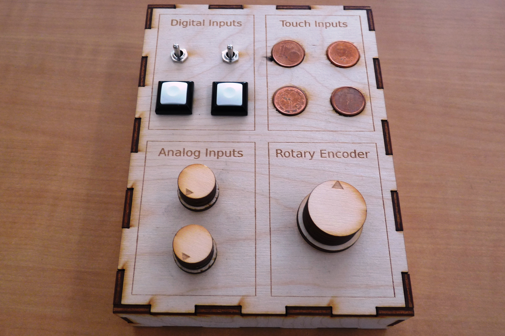

# Connected Scenic Object Framework

## Wait... What is it?
This framework should help you to design and prototype quickly **Objects** (by attaching them **Devices**) that will 
communicate through WiFi with **Applications** running on a **Conductor Computer**. 
It is intended for scenic use but not restricted to it. All the communication is done following the 
[Open Sound Control](http://opensoundcontrol.org/) (OSC) protocole. 
We chose to write our softwares using [Arduino IDE](https://www.arduino.cc/en/Main/Software)
and [Processing](https://processing.org/) because they are open, well maintained, accessible to begginers and
already spread amongst the maker community. You can find a lot on ressources on the net,
should you encounter a problem.

Just to help, here are some definitions on our own :
<DL>
	<DT><STRONG>Device</STRONG>
	<DD>Any kind of electronic sensor (button, potentiometer, accelerometer...) or actuator (servo, relay, LED...)
	intended to work with an ESP32 board. We provide the classes to interact with 9 basic types of devices 
	but you can create your own.
	<DT><STRONG>Status LED</STRONG>
	<DD>A special type of device. It consists on a single WS2812B programmable LED and its color is used
	to give a feedback on the internal state of the object.
	<DT><STRONG>Object (or Module)</STRONG>
	<DD>An ESP32 board and all of its devices (optionnally enclosed into a beautiful box).
	<DT><STRONG>Application</STRONG>
	<DD>A piece of software that can handle OSC messages to do something (like playing sound sample for example) 
	and send OSC messages back to control the devices on the objects.
	<DT><STRONG>ModuleManager</STRONG>
	<DD>A software we provide to manage your objects on a (not so) nice GUI. 
	It also acts as a relay for OSC messages between objects and applications and need to be running while you
	are using them. It was written in Processing.
	<DT><STRONG>Conductor Computer (or just Conductor)</STRONG>
	<DD>The computer (generally a laptop for mobility convenience) on which are running the ModuleManager 
	and the applications.
</DL>

Feel free to explore the [Example](Example/) folder to get a better understanding.


## Create a local WiFi network
You can either :
* use a WiFi router as access point to connect your conductor and all of yours objects 
* [configure a WiFi hotspot](https://www.howtogeek.com/214080/how-to-turn-your-windows-pc-into-a-wi-fi-hotspot/) 
on your conductor so that the objects connect directly to the computer.

In any case, be careful to remember the SSID and password of your freshly set-up local network.


## Create an Object (Module)

This is a module given in Example folder and called ControllerTestModule. it only has input devices.



### What you will need
* One or more ESP32 boards (one per object)
* [Arduino IDE](https://www.arduino.cc/en/main/software) 1.8.5 or later 
with [ESP32 boards support](https://github.com/espressif/arduino-esp32#installation-instructions)
* *ConnectScenicObject* and third party librairies following the [Arduino_libs/Readme](Arduino_libs/Readme.md) instructions
* At least one WS2812B 5V programmable LED (status LED)
* Some devices according to your needs (buttons, potentiometers, relays, LEDs, softPots, WS2812B strips...)
* A way to power the ESP32 board and possibly your devices (battery or power adapter)

### Add devices to your object
Connect the WS2812B status led to one of the compatible DIOs of the ESP32 Board 
(see [this file](Arduino_libs/ConnectedScenicObject/AvailableDevicePins.h) for a list of LED strip compatible pins).
Connect / solder your devices to the ESP32 board.

The wiring of the object ControllerTestModule in Example looks like this : 


### Program the object
You will need to install ConnectedScenicObject and third party libs to your Arduino IDE.
Please refer to Arduino_libs and subfolders readme for more information.
Don't forget that each device physically connected to the ESP32 board should result in a 
device declaration in your Object's code.

The declaration of the devices used in the ControllerTestModule look like this :

```cpp
#define SW_0_PIN 17
#define SW_1_PIN 5
#define BUT_2_PIN 16
#define BUT_3_PIN 4

#define TOUCH_0_PIN 13
#define TOUCH_1_PIN 12
#define TOUCH_2_PIN 14
#define TOUCH_3_PIN 27

#define ANALOG_0_PIN 32
#define ANALOG_1_PIN 35

#define ROT_ENC_PIN_1 21
#define ROT_ENC_PIN_2 19
#define ROT_BUT_PIN 18

...

ConnectedScenicObjectError err;
// add some buttons
err += cso.addDevice(DIGITAL_INPUT, new DigitalInputDevice(SW_0_PIN));
err += cso.addDevice(DIGITAL_INPUT, new DigitalInputDevice(SW_1_PIN));
err += cso.addDevice(DIGITAL_INPUT, new DigitalInputDevice(BUT_2_PIN));
err += cso.addDevice(DIGITAL_INPUT, new DigitalInputDevice(BUT_3_PIN));
// add touch inputs
err += cso.addDevice(TOUCH_INPUT, new TouchInputDevice(TOUCH_0_PIN, 0.45, 5));
err += cso.addDevice(TOUCH_INPUT, new TouchInputDevice(TOUCH_1_PIN, 0.45, 5));
err += cso.addDevice(TOUCH_INPUT, new TouchInputDevice(TOUCH_2_PIN, 0.45, 5));
err += cso.addDevice(TOUCH_INPUT, new TouchInputDevice(TOUCH_3_PIN, 0.45, 5));
// add Analog inputs
err += cso.addDevice(ANALOG_INPUT, new AnalogInputDevice(ANALOG_0_PIN, 0.01, 5));
err += cso.addDevice(ANALOG_INPUT, new AnalogInputDevice(ANALOG_1_PIN, 0.01, 5));
// add a rotary encoder
err += cso.addDevice(ROTARY_ENCODER, new RotaryEncoderDevice(ROT_ENC_PIN_1, ROT_ENC_PIN_2, ROT_BUT_PIN));
// if error occured when creating devices, set the status led orange for 5 seconds
if(err.code) {
	Serial.println(err.message);
	cso.setStatusLed(COLOR_WARNING);
	delay(5000);
}
```

## Create an application

### What you will need


## Configure the Module Manager

### Create types


## License
Copyright (c) 2019 [UMONS](https://web.umons.ac.be/en/) - [numediart](https://web.umons.ac.be/numediart/fr/accueil/) - [CLICK'](http://www.clicklivinglab.org/)
 
*ConnectedScenicObject* is free software; you can redistribute it and/or
modify it under the terms of the GNU Lesser General Public
License as published by the Free Software Foundation; either
version 2.1 of the License, or (at your option) any later version.

This library is distributed in the hope that it will be useful,
but WITHOUT ANY WARRANTY; without even the implied warranty of
MERCHANTABILITY or FITNESS FOR A PARTICULAR PURPOSE.  See the GNU
Lesser General Public License for more details.

You should have received a copy of the GNU Lesser General Public
License along with this library; if not, write to the Free Software
Foundation, Inc., 51 Franklin Street, Fifth Floor, Boston, MA  02110-1301  USA

## Legal Notices
This work was produced as part of the FEDER Digistorm project, co-financed by the European Union and the Wallonia Region.

